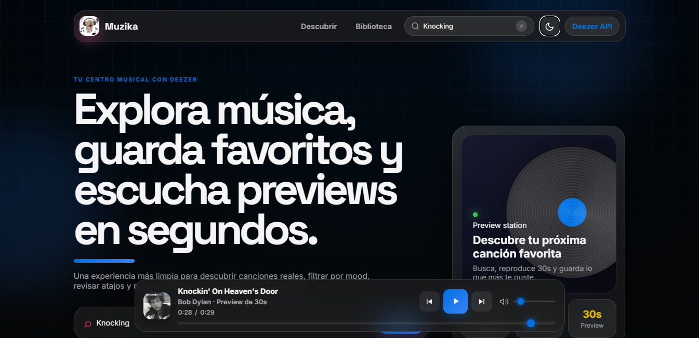
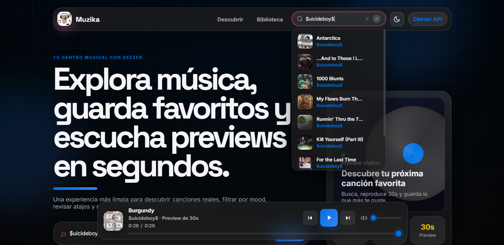
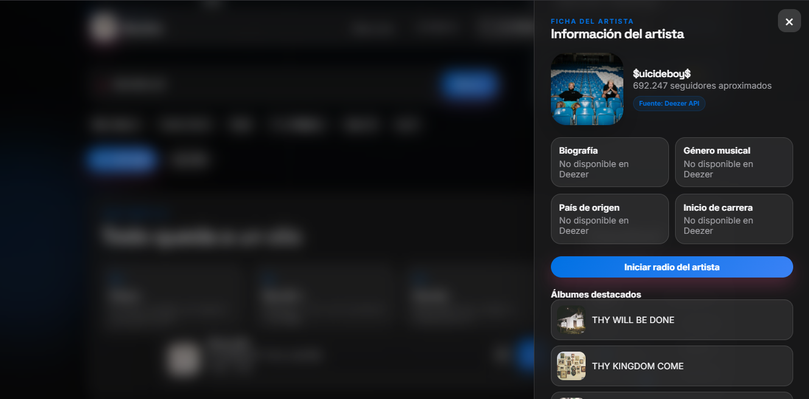

# Muzika 🎧

Proyecto de clase hecho por **Henry Morales**.

Muzika es un pequeño explorador de música que armé con HTML, CSS y JavaScript puro. Se conecta a la API pública de Deezer para buscar canciones, escuchar previews de 30 segundos y guardar favoritos. No usa frameworks ni librerías externas, todo está hecho desde cero.

## ¿Qué hace?

- Muestra el top global de canciones de Deezer.
- Permite buscar por artista, canción o álbum.
- Abre una ficha con la portada, duración y enlace a la canción.
- Reproduce previews de 30 segundos.
- Guarda favoritos en el navegador usando `localStorage`.
- Muestra información del artista, álbumes destacados y canciones populares.
- Tiene tema claro/oscuro y funciona en el celular.

## Cómo se ve

### Vista de inicio



### Buscador



### Panel de artista



## Tecnologías

- HTML5
- CSS3
- JavaScript vanilla
- API pública de Deezer
- `localStorage` para favoritos

## Cómo ejecutarlo

1. Clona el repo.
2. Abre `index.html` en el navegador.
3. Listo, no necesita instalar nada.

> Necesitas conexión a internet para que funcione la búsqueda y el top global.

## Estructura del proyecto

```text
.
├── assets/
│   ├── muzika.ico
│   ├── muzika.jpg
│   └── screenshot-*.png
├── css/
│   ├── variables.css
│   ├── reset.css
│   ├── styles.css
│   └── responsive.css
├── js/
│   ├── api.js
│   ├── utils.js
│   └── app.js
├── index.html
└── README.md
```

## Notas

- Deezer no siempre habilita CORS directo en navegadores, por eso el proyecto usa proxies de respaldo en `js/api.js`.
- Algunos datos del artista (biografía, país, género) no vienen en los endpoints públicos, por eso aparecen como no disponibles.
- El diseño está inspirado en interfaces limpias tipo Apple, con esquinas redondeadas, blur y un modo oscuro/claro.

---

Hecho con paciencia, café y muchas pruebas en el navegador.
